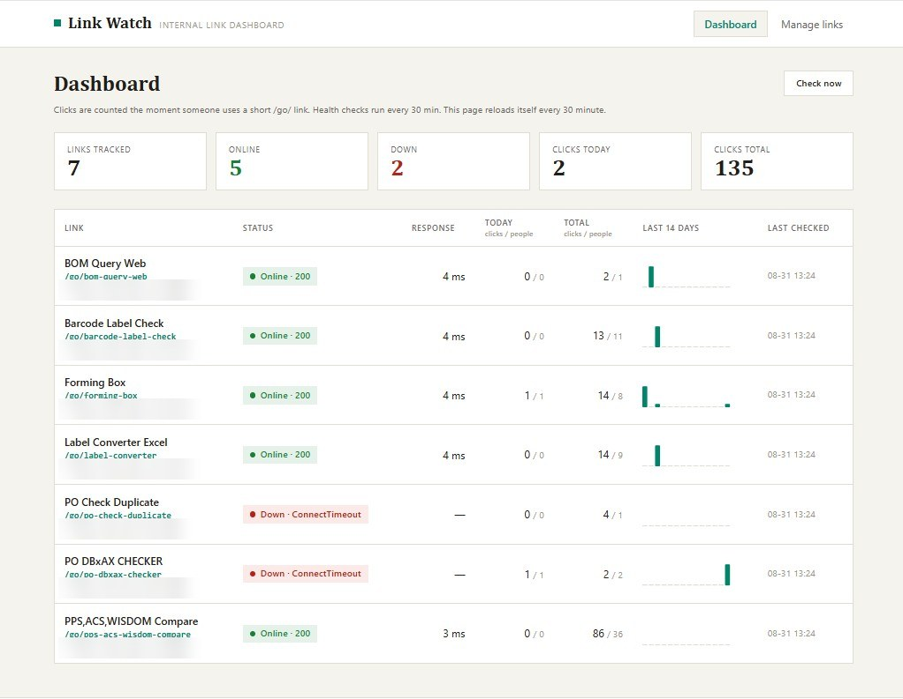
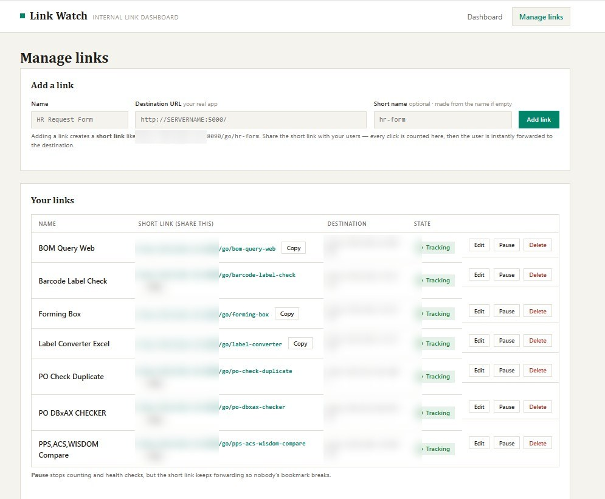

# Link Watch

**An internal link dashboard: how often each company link is used, by how many people, and whether it is up right now.**

<p>
  
  
  
  
  
  
  
</p>

Built for the IT team at **Hi-Tech Apparel**. It hands out short links for the internal apps,
counts every click, and pings each destination every few minutes so a broken tool is noticed before
someone reports it. Runs on your own server — no internet, no external service, nothing leaves the
network.

---

## The problem it solves

Internal apps get shared as raw addresses like `http://SERVERNAME:5000/`, and after that nobody
knows anything: is this tool actually used? by how many people? has it been down since Tuesday?

Link Watch answers all three by **putting itself in front of the door** — the same trick bit.ly
uses:

```
You share:                 http://SERVERNAME:8090/go/hr-form
                                        |
                                        v   (the click is counted here)
User instantly lands on:   http://SERVERNAME:5000/   (your real app)
```

1. Add a link in the dashboard → you get a short link like `.../go/hr-form`
2. Share the **short** link (email, Teams, intranet page)
3. Every click is recorded — total clicks and how many different people (by IP) — then the visitor
   is forwarded on in a few milliseconds
4. Separately, every destination is pinged on a timer, giving Online / Down and a response time

Your apps need **no changes at all** — the dashboard never touches them, it just owns the address
people click.



<sub>Seven internal tools tracked — clicks today and all-time, how many different people, response
time, and a 14-day bar chart per link. The destination addresses are blurred; the `/go/` short
names are not secret.</sub>

---

## What the dashboard shows

Across the top, a **fleet health dial** shows at a glance what share of your links are answering
right now, next to the running totals — links tracked, online, down, clicks today, clicks all-time.
The **Down** tile turns red the moment anything stops answering.

Then one row per link:

| Column | Meaning |
|---|---|
| **Status** | 🟢 Online / 🔴 Down — rechecked on a timer (`check_interval_minutes`, 30 by default), with a **Start** button beside it when the app is down |
| **Response** | how fast the link answered, in milliseconds, with a small meter beside the number |
| **Today** | clicks today / how many different people today |
| **Total** | all-time clicks / all-time different people |
| **Last 14 days** | a 14-day bar chart of clicks per day — today's bar is highlighted |
| **Last checked** | when the last health check ran |

The page refreshes itself every minute, and **Check now** forces an immediate health check.

---

## Features

- **Short links that count clicks** — a `302` redirect on purpose, so browsers keep coming back
  through the dashboard instead of remembering the destination and skipping the count.
- **People, not just hits** — clicks are stored per day *and* per IP, so "12 clicks by 4 people"
  is a question the database can answer.
- **Health checks on a timer** — every destination is called directly (never through the company
  proxy, which would answer instead of the real app and fake the result).
- **Start an app again without opening a terminal** — when the server reboots, every internal app
  goes down with it. Each link can be given a start command, which puts a **Start** button next to
  its status, plus **Start all down** to bring everything back in one click. It refuses to start
  something that is already answering, so you can never end up with two copies fighting over the
  same port.
- **Pause without breaking bookmarks** — a paused link stops counting and checking but keeps
  forwarding, so nobody's saved link dies.
- **Tiny, backup-friendly storage** — one SQLite file, `data.db`. Storing one row per day + IP
  instead of one row per click keeps it small forever.
- **Reads on any screen** — on a phone or a narrow window the table stops being a table: each link
  becomes its own card carrying its column labels, so nothing has to be scrolled sideways.
- **Light and dark** — the dashboard follows the Windows theme setting automatically. No toggle to
  find, nothing to configure.
- **No internet needed** — plain HTML + CSS pages, no JS framework, no CDN, no web fonts. Every
  font ships with Windows and the tab icon is inlined, so nothing is ever fetched from outside.
  Works on a server with no outside access.

---



<sub>**Manage links** — add a destination, get a short link to share, and pause or delete it later.
The server address in each short link is blurred; the `/go/` part is what makes them readable.</sub>

---

## Running it

```bash
pip install -r requirements.txt
python app.py
```

Then open **http://localhost:8090**.

The first run creates `data.db`, and with `sample_mode = true` in `config.ini` it also creates 4
demo links with fake click history so you can try everything safely. Set `sample_mode = false` on
the real server.

> **Setting `sample_mode = false` does not remove demo data that is already there.** The seeder
> only skips when the database is empty, so demo links created by an earlier run stay in `data.db`
> and keep showing on the dashboard. Delete them on the **Manage links** page (or start fresh by
> deleting `data.db`) — the flag alone only stops *new* seeding.

> The dashboard has to stay running for clicks to be counted — the short links are served by it.
> On a server, start it automatically (Task Scheduler recipe in the guide).
>
> The dashboard cannot start *itself* — it is the one thing you launch by hand (or by scheduled
> task) after a reboot. Once it is up, its Start buttons bring back everything else.
>
> **Start** never replaces a copy that is already running. To load a new version (new files
> copied to the server), press **Restart**: it stops whatever holds the app's `port` (set in
> `config.ini`) and starts it fresh. Without a `port`, Start can launch a second copy that dies
> on "address already in use" while the **old** version keeps serving.
>
> Clicks are only counted through the **short** link. Opening the destination address directly is
> invisible to the dashboard.

---

## Under the hood

| | |
|---|---|
| **Built with** | Python + [Flask](https://flask.palletsprojects.com/) 3, SQLite (built in), [APScheduler](https://apscheduler.readthedocs.io/) for the timed checks, [requests](https://requests.readthedocs.io/) for the pings, Jinja2 templates |
| **The app** | [`app.py`](app.py) — pages, the `/go/<slug>` counting redirect, the scheduler |
| **Health checks** | [`collector.py`](collector.py) — pings every link, saves status + response time |
| **Start / Restart buttons** | [`runner.py`](runner.py) — launches the app behind a link, detached, output to `logs/`; with a `port` it refuses to start over an old copy, and Restart stops that copy first |
| **Storage** | [`db.py`](db.py) — 3 tables: `links`, `daily_hits` (per day + IP), `checks` (kept 30 days) |
| **Look and feel** | [`static/`](static) — `tokens.css` (every colour, both themes), `style.css` (page shell, forms, buttons), `components.css` (stat tiles, health dial, link table, charts) |
| **Settings** | [`config.ini`](config.ini) — port, check interval, timeout, SSL verification, sample mode, start commands |
| **Tests** | [`tests/`](tests) — `python -m pytest tests/` (the launcher tests spawn real processes) |

Default port is **8090** (8080 is taken by another app on the dev machine). Changing the port
changes every short link, so pick it before sharing links with people.

---

## Documentation

**[docs/DEVELOPER-GUIDE.md](docs/DEVELOPER-GUIDE.md)** — the full guide: adding and checking
links, changing the port (and checking it is free), opening the firewall, deploying to the server,
starting automatically after a reboot, every `config.ini` setting, how the counting and health
checks work internally, the database design, and troubleshooting.

---

<sub>Internal tool for HI-TECH APPAREL · `data.db` holds all links and click history and is
excluded by `.gitignore` — back it up by copying that one file.</sub>
